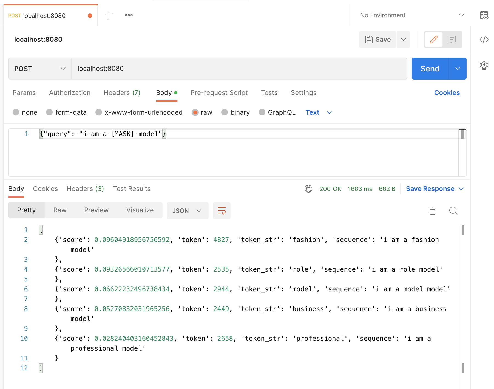

## Running the model

To start the server on local machine, run

```
python3 models/bert-base-uncased/main.py
```

## To run the docker image

```
docker run --rm -it -p 8080:8080 annanay25/nautical-bert-base-uncased:latest
```

## Query the model / call the model API

The model is accessible at `https://localhost:8080`. The below screenshot shows how to query it using [Postman](https://www.postman.com/).

